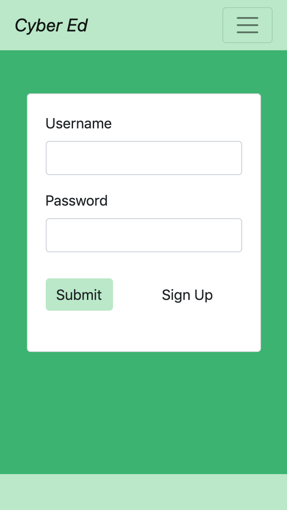
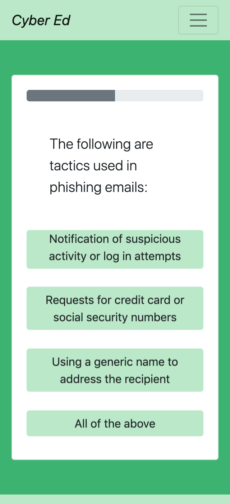
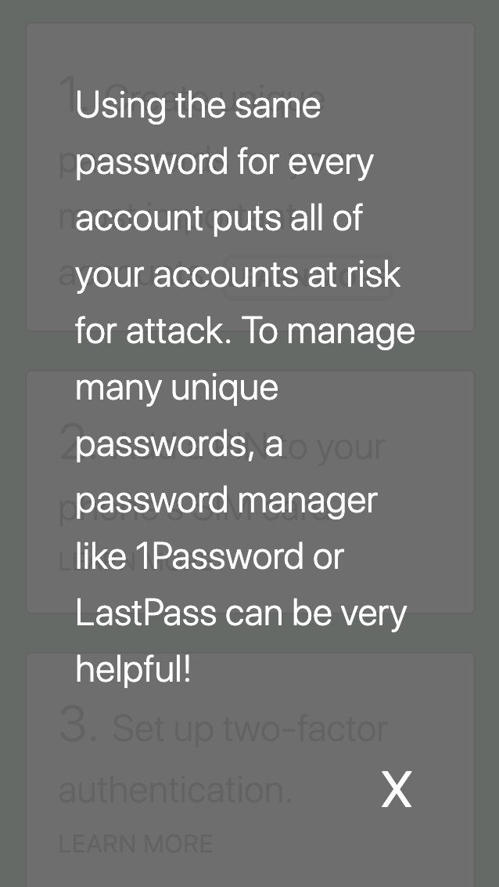
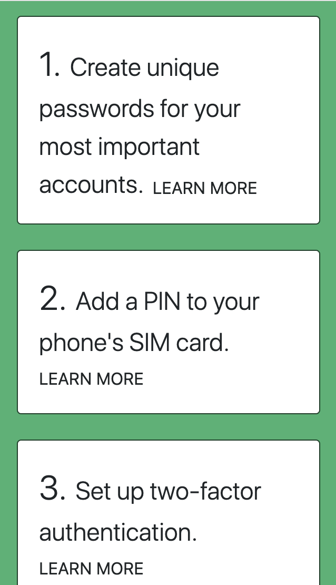

# Cyber Ed

## About

This app helps the average person with a digital presence to protect their privacy online.

## Planning

[KanBan, User Stories, and Wireframes](https://github.com/zoe-gonzales/cyber-ed/tree/master/process)

## Usage

On the homepage, click the *Take the Quiz* button and complete the 10-question quiz.

Once completed, results will be shown with the correct answer for each question along with your answer. Click the button for each question to learn more about that topic.

If you'd like to sign up to view an action plan for increasing your personal security online, you can choose a username, nickname, and password on the *Sign Up* page.

This page will automatically redirect you to the action plan page which has more resources.

If you're returning to your account, use *Log In* to go to the home page. 

Sample Text Login:
` username: user1 `
` password: password1 `

#### Additional Pages

**About:** Overview of motivations for creating the app.

**Learn:** Resources for further reading, which were also used to create the quiz questions and recommendations.

## Demo

Video demo: https://drive.google.com/file/d/1laD0rAt0MkxvOtTeEVabQMphWKRhHuQ6/view?usp=sharing

## Technologies
* Node & Express
* React with hooks
* Mongo & Mongoose
* Passport, Bcrypt, and JSON Web Tokens

## Challenges
Building the app's authentication was challenging, and the following are areas of improvement that are currently being worked on:
* Using bycrypt to hash all passwords
* Send the JWT in the headers to properly verify the token
* Completing log out functionality

## Responsiveness
This app was created with mobile responsiveness in mind.

