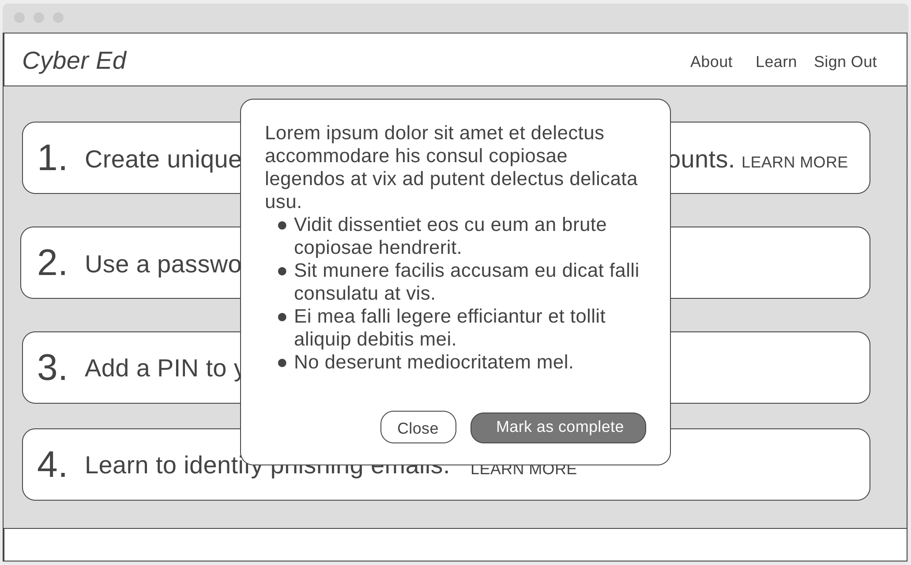

# Cyber Ed

## About

This app helps the average person with a digital presence to protect their privacy online.

## Planning

[Kanban](https://github.com/zoe-gonzales/cyber-ed/projects/1)

### User Stories

**Feature #1:** Individual Security Quiz + Results

As a user,
I want to learn about information security in a digestible, stress-free way
So that I can be better informed without becoming overwhelmed.

As a user,
I want an easy way to understand my current knowledge of information security best practices
So that I can determine best steps moving forward to protect my information online.

*Breakdown:*

As a user, 
I want to go to the site, take a quick and simple quiz, and get results
So that I can test my understanding of individual information security.

As a user,
I want easily understandable results from my quiz
So that I leave the site with more knowledge of information security best practices than when I first visited it.

As a user,
I want to receive clear examples and answers to information security questions
So that I can be better informed when protecting my personal data online.

**Feature #2:** Personalized report of Information Security To Do List

As a user,
I want to know exactly what steps I need to take, based on my personal situation,
So that I can protect my information online.

*Breakdown:*

As a user,
I want clear, digestible, and visually appealing instruction on how to protect my data online
So that I can understand the steps easily.

As a user,
I want information security steps that are actionable and straightforward
So that I spend as little time as possible in establishing security for myself.

As a user,
I want to be able to log in at a later time and retrieve my personal action plan
So that I can keep track of my progress if I can’t do all the steps at once.

As a user,
I want to be able to mark action items as complete
So that I can track my progress.

As a user,
I want to be able to create a new log in or log in with my Google Account
So that I can ensure proper authentication of my account each time I log in.

**Feature #3:** About page. Explanation of why hackers hack.

As a user,
I want to understand why information security is important
So that I can understand how and why to protect myself.

*Breakdown:*

As a user,
I want a personable and straightforward explanation of why information security is important
So that I can be motivated to take the suggested steps and become more aware of my online privacy.

As a user,
I want to learn about information security
Without being inundated with information.

**Feature #4:** Resources page. Guide to industries experts, publications, and organizations to follow.

As a user curious about Cybersecurity,
I want to know what experts and content creators to follow
So that I can become better informed.

*Breakdown:*

As a user,
I want a simple and straightforward guide to the InfoSec industry
So that I can learn more about it from reliable sources.

As a user,
I want to see specific resources used to develop the quiz, results, and personal action plan
So that I feel comfortable trusting the site with my information.

### Wireframes

Landing Page

Question - text-only

Question - with image

Results - desktop

Results - mobile

Plan - desktop

Plan Detail - desktop

Plan - mobile

Plan Detail - mobile

